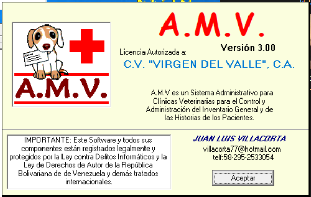
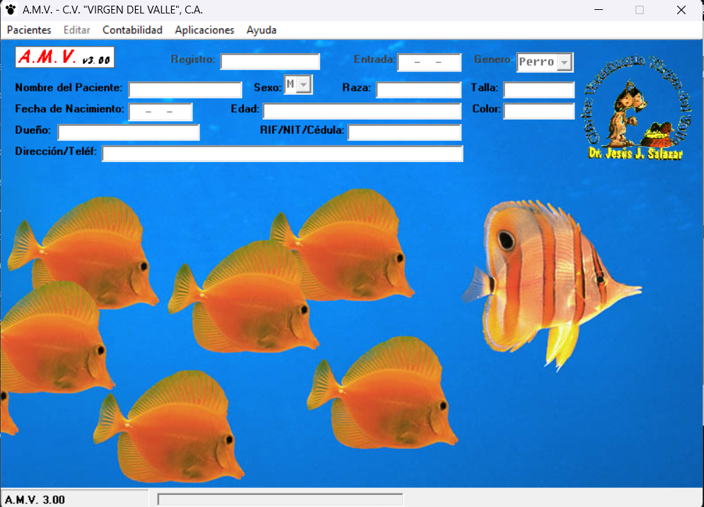
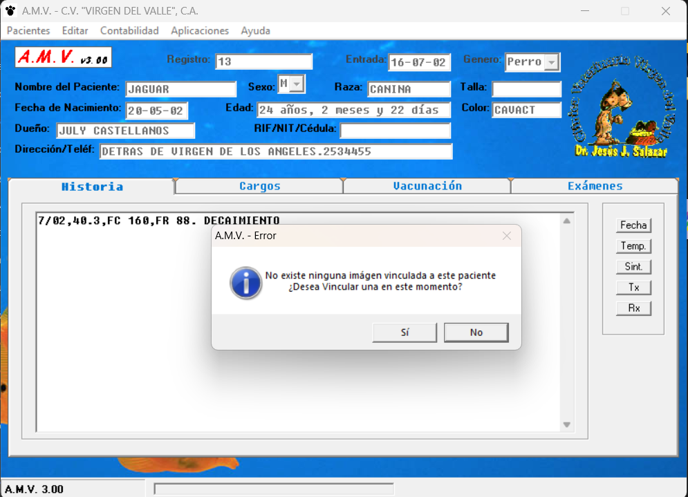
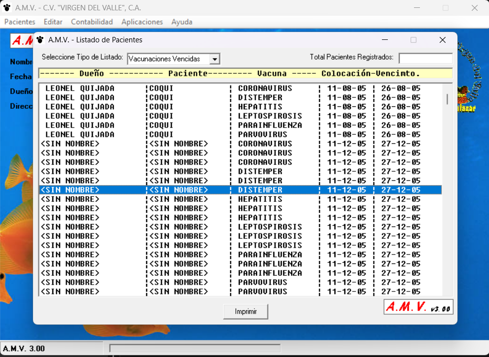
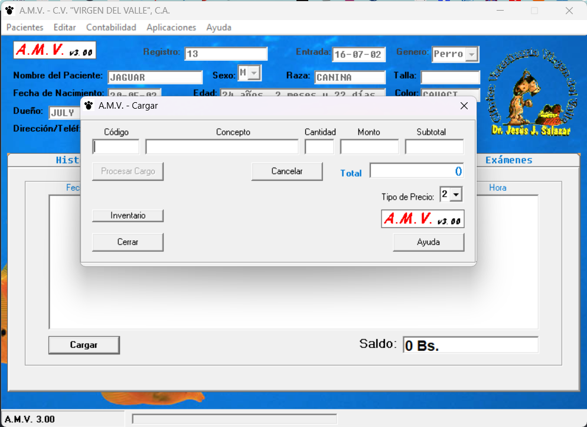
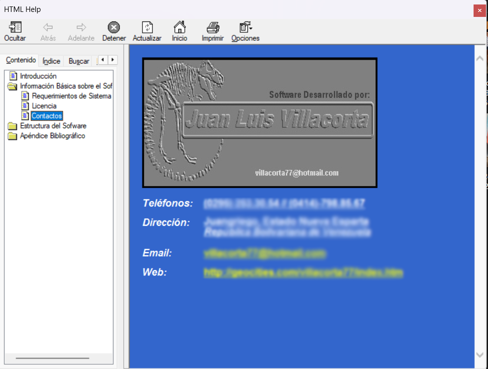

### 🐾 A.M.V.® (Asistente Médico Veterinario) - Legacy Software Preservation (2002)

### 📸 Capturas de Pantalla / Screenshots

[Español](#español) | [English](#english) 

### Español

### 🌟 Acerca del Proyecto

Este repositorio está dedicado a la preservación digital de **A.M.V.®**, un sistema de gestión clínica, CRM y contabilidad desarrollado en el año **2002** para automatizar las operaciones diarias de clínicas veterinarias. 

Aunque el código fuente original no está disponible, este espacio conserva el binario ejecutable (.EXE), los archivos de configuración del sistema y la documentación técnica de su arquitectura lógica. El software es un testimonio funcional de sistemas administrativos independientes y de alto rendimiento diseñados a inicios de la década de los 2000. 

### 🛠️ Módulos y Arquitectura del Sistema

* **Módulo de Pacientes (CRM Clínico):** Control detallado de fichas clínicas, alertas de vencimiento de vacunas y una biblioteca de imágenes compatible con hardware de captura de la época (WebCams y escáneres). Incorpora un algoritmo nativo para calcular la edad exacta del paciente desglosada en **años, meses y días**.
* **Módulo de Contabilidad e Inventario (ERP):** Administración del inventario general, procesamiento de ventas al detal, facturación e historial transaccional de compras y gastos mensuales.
* **Módulo de Aplicaciones Clínicas:** Generador de récipes médicos e informes de exámenes de laboratorio con impresión directa integrada.

### 💾 Motor de Base de Datos Nativo (TYPE Estilo MS-DOS)

A diferencia de los sistemas comerciales comunes de la época que dependían de motores pesados como MS Access, A.M.V.® implementó una arquitectura de almacenamiento de datos ultra-ligera heredada de las técnicas avanzadas de MS-DOS: 

* **Estructuras de Longitud Fija:** Almacenamiento basado en estructuras personalizadas de registros (**TYPE**).
* **Archivos Binarios de Acceso Aleatorio (RANDOM):** El motor lee y escribe flujos de bytes puros directamente en el disco duro mediante punteros indexados, optimizando el rendimiento y garantizando la portabilidad absoluta del software (arquitectura *Portable/Zero-Installation*).

### 📊 Algoritmos y Fórmulas de Negocio Implementadas

El núcleo del software procesaba el cuadre de caja diario y la contabilidad mediante las siguientes ecuaciones financieras integradas: 

1. **Balance de Operaciones Diarias:**

Saldo Pendiente=[Ventas del Día]−[Efectivo+Cheques+Cuentas por Cobrar+Ajustes]Saldo Pendiente equals open bracket Ventas del Día close bracket minus open bracket Efectivo plus Cheques plus Cuentas por Cobrar plus Ajustes close bracket
Saldo Pendiente=[Ventas del Día]−[Efectivo+Cheques+Cuentas por Cobrar+Ajustes]

*(El sistema validaba de forma estricta que este saldo fuera equivalente a cero).*
2. **Cierre de Flujo de Efectivo en Caja:**

Saldo Total en Caja=[Efectivo+Cheques]−[(Compras+Gastos)−Cuentas por Pagar]Saldo Total en Caja equals open bracket Efectivo plus Cheques close bracket minus open bracket open paren Compras plus Gastos close paren minus Cuentas por Pagar close bracket
Saldo Total en Caja=[Efectivo+Cheques]−[(Compras+Gastos)−Cuentas por Pagar]

### ⚙️ Configuración Orientada a Datos (Estructura .INI)

Por razones de seguridad e integridad del núcleo del software, los rangos de referencia clínicos de laboratorio se desacoplaron del código ejecutable. El sistema utiliza una arquitectura basada en el archivo de texto estructurado AMVSYS\AMVSTR.INI bajo el siguiente estándar: 

* Comentarios e inhabilitación de pruebas anteponiendo un punto y coma (;).
* Bloques de datos indexados mediante numeraciones estrictas de 6 dígitos (000001 a 999999) bajo las secciones:
[Valores Hematológicos], [Valores Bioquímicos], [Valores Orina] y [Valores Heces].

### English

### 🌟 About the Project

This repository is dedicated to the digital preservation of **A.M.V.® (Asistente Médico Veterinario)**, a comprehensive clinical management, CRM, and accounting suite developed in **2002** to automate the daily workflows of veterinary clinics. 

While the original source code is no longer available, this repository preserves the compiled executable binary (.EXE), core system files, and technical documentation of its black-box logical architecture. The software stands as a functional testament to robust administrative applications engineered in the early 2000s. 

### 🛠️ Core Modules & System Architecture

* **Patient Module (Clinical CRM):** In-depth clinical records, vaccine expiration tracking, and an image library supporting contemporary video hardware (WebCams/scanners). It features a native algorithm to calculate the patient's exact age down to **years, months, and days**.
* **Accounting & Inventory Module (ERP):** General inventory management, retail point-of-sale checkout, legal invoicing, and transactional logs tracking monthly business expenses.
* **Clinical Applications Module:** Prescription generator and laboratory test layout engines featuring integrated native printing.

### 💾 Native Flat-File Database Engine (MS-DOS TYPE Style)

Unlike standard applications of the era that relied on bulky database instances like MS Access, A.M.V.® implemented an ultra-lightweight data-storage infrastructure derived from high-performance MS-DOS programming mechanics: 

* **Fixed-Length Records:** Object storage mapped directly via custom record structures (**TYPE**).
* **Random-Access Binary Files (RANDOM):** The core engine executes raw byte-stream reads and writes straight to disk via indexed file pointers. This achieved lightning-fast I/O benchmarks and a completely zero-installation dependency model.

### 📊 Embedded Business Logic & Financial Algorithms

The engine automated daily bookkeeping and financial closures utilizing the following embedded math equations: 

1. **Daily Operational Balance:**

Pending Balance=[Daily Sales]−[Cash+Checks+Accounts Receivable+Adjustments]Pending Balance equals open bracket Daily Sales close bracket minus open bracket Cash plus Checks plus Accounts Receivable plus Adjustments close bracket
Pending Balance=[Daily Sales]−[Cash+Checks+Accounts Receivable+Adjustments]

*(The system strictly validated that this balance resolved to exactly zero).*
2. **Cash Drawer Flow Auditing:**

Total Cash Balance=[Cash+Checks]−[(Purchases+Expenses)−Accounts Payable]Total Cash Balance equals open bracket Cash plus Checks close bracket minus open bracket open paren Purchases plus Expenses close paren minus Accounts Payable close bracket
Total Cash Balance=[Cash+Checks]−[(Purchases+Expenses)−Accounts Payable]

### ⚙️ Data-Driven Configuration (🔌 .INI Architecture)

For core software security, clinical laboratory reference ranges were entirely decoupled from the binary codebase. The engine relies on a custom implementation reading structured metadata from AMVSYS\AMVSTR.INI utilizing the following rules: 

* Feature toggling and test suppression via semicolon leading comments (;).
* Rigid 6-digit zero-padded indexing (000001 to 999999) under the designated sections:
[Valores Hematológicos], [Valores Bioquímicos], [Valores Orina], and [Valores Heces].

*Proyecto histórico rescatado y preservado. Ingeniería de sistemas de la era dorada del software de escritorio de 32 bits.*